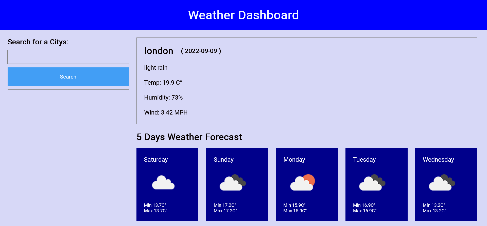

 weather-dashboard-app

# description
Weather-Dashboard is an application to find a weather condition of a given city both the current and 5-Days forecast at the same time. The server-side API used to get response data object is retrieved from the Open Weather APi. 

# User Story
AS A traveler
 WANT to see the weather outlook for multiple cities
SO THAT  can plan a trip accordingly

# Technologies Used
JavaScript
OpenWeather API
HTML
CSS

# repository link
https://github.com/kusalaindika1/weather-dashboard-app

# deploy link
https://kusalaindika1.github.io/weather-dashboard-app/

Screenshots:
